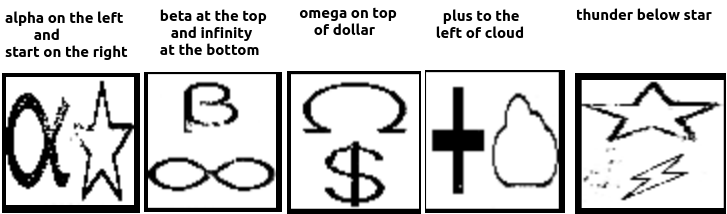
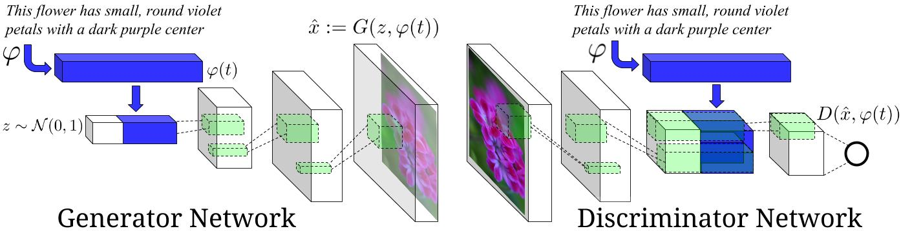
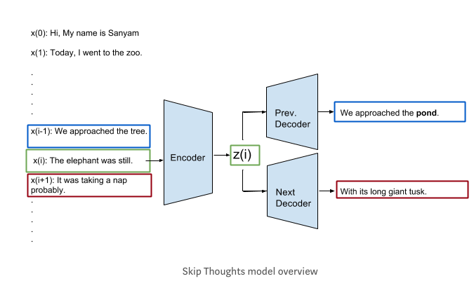

# Reverse-Image-Captioning

This task is just the reverse of image captioning task. Here, we are trying to generate the images that best fit the textual description.

Here's the sample output of the network.

### YouTube Video showing use of GUI

### Dependencies
* Python 2.7
* Pytorch
* Theano 0.7
* A recent version of [NumPy](http://www.numpy.org/) and [SciPy](http://www.scipy.org/)
* [scikit-learn](http://scikit-learn.org/stable/index.html)
* [NLTK 3](http://www.nltk.org/)
* [Keras](https://github.com/fchollet/keras) (for Semantic-Relatedness experiments only)
* [gensim](https://radimrehurek.com/gensim/) (for vocabulary expansion when training new models)

In addition, please `pip install` the following packages:
- `tensorboard tensorboardX tensorboard-pytorch`
- `python-dateutil`
- `easydict`
- `pandas`
- `torchfile`
- `wget`
- `Tkinter`

## Getting started

You will first need to download the model files and word embeddings. The embedding files (utable and btable) are quite large (>2GB) so make sure there is enough space available. The encoder vocabulary can be found in dictionary.txt.

    wget http://www.cs.toronto.edu/~rkiros/models/dictionary.txt
    wget http://www.cs.toronto.edu/~rkiros/models/utable.npy
    wget http://www.cs.toronto.edu/~rkiros/models/btable.npy
    wget http://www.cs.toronto.edu/~rkiros/models/uni_skip.npz
    wget http://www.cs.toronto.edu/~rkiros/models/uni_skip.npz.pkl
    wget http://www.cs.toronto.edu/~rkiros/models/bi_skip.npz
    wget http://www.cs.toronto.edu/~rkiros/models/bi_skip.npz.pkl

## List of available shapes

``[percentage, omega, copyright, beta, ampersand, sigma, right arrow, down arrow, octagon, minus, euro, cube, up arrow, thunder, ellipse, plus, circle, question mark, square braces, curly braces, left arrow, semicolon, heptagon, less than, infinity, rectangle, heart, root, set union, pie, hashtag, double horizontal arrow, square, cloud, pound, asterisk, dollar, pentagon, star, multiplication, double vertical arrow, phi, cent, hexagon, equality, alpha, images, lambda, triangle, set intersection, greater than, exclamation mark]``

## Steps to run GUI
1. Clone the repository using ``git clone https://github.com/aditya30394/Reverse-Image-Captioning.git``
2. Change the directory to ``Reverse-Image-Captioning``.
3. Make sure you have necessary permissions. You can use ``chmod 777 `` This step may not be necessary.
4. Use the following command - ``python download_skipthought.py}`` in terminal to download necessary skip-thought model files. Please note that these files are very large (approx. 4GB in total) so make sure you have enough space. Alternatively, you can also use wget command to download the files - see the [GitHub Readme](https://github.com/aditya30394/Reverse-Image-Captioning/blob/master/README.md#getting-started) for exact commands.
5. Use the following command - ``python gui_rev_img_cap_model.py`` in terminal to start the GUI.
6. Enter the description of image in the text field and click ``Generate Image`` button. See the Step 7 for the list of available shapes. You can specify left-right and top-bottom combination to describe your images. See the figure at the top of this readme file to see examples. **Don't use punctuation marks like comma, period, etc. in your description**.
7. Available 2D Shapes are : ``[percentage, omega, copyright, beta, ampersand, sigma, right arrow, down arrow, octagon, minus, euro, cube, up arrow, thunder, ellipse, plus, circle, question mark, square braces, curly braces, left arrow, semicolon, heptagon, less than, infinity, rectangle, heart, root, set union, pie, hashtag, double horizontal arrow, square, cloud, pound, asterisk, dollar, pentagon, star, multiplication, double vertical arrow, phi, cent, hexagon, equality, alpha, images, lambda, triangle, set intersection, greater than, exclamation mark]``
8. Repeat step 6 for trying other inputs.
9. Click ``Exit`` button to close the GUI.
  
## Data

1. Download my 2D shape dataset from [this google drive link](https://drive.google.com/drive/folders/1lr5IkmM9fwbrvElF6LHgMH5C3vpDul03?usp=sharing) and put the images in ``data/images`` folder (already present in the repo).
2. Download the file caption embedding form [this Google Drive link](https://drive.google.com/open?id=1nefAwuWRPcor9361NKRZqsipiYw2S5a9) and put it in the ``data`` folder.
3. The caption file contains the description of each file. Each line of the file contains two commas separated values. The first one is the file name and the second one is its caption. The file can be found here: [Caption File](https://drive.google.com/file/d/1VCRNI_pbqBsAMqQ-KIpICwXaQfW-bIa0/view?usp=sharing)

## Training
1. Clone the repository using ``git clone https://github.com/aditya30394/Reverse-Image-Captioning.git``
2. Change the directory to ``Reverse-Image-Captioning``.
3. Make sure you have necessary permissions. You can use ``chmod 777`` This step may not be necessary.
4. Download the file caption embedding form [this Google Drive link](https://drive.google.com/open?id=1nefAwuWRPcor9361NKRZqsipiYw2S5a9) and put it in the ``data`` folder. This is extremely important.
5. Use the following command - ``python main.py --log_step 80`` in the terminal to start the training.

**Pretrained Model**
- [Generator](https://github.com/aditya30394/Reverse-Image-Captioning/blob/master/final_model/184-G.ckpt). Download and save it to `checkpoints`.
- [Discriminator](https://github.com/aditya30394/Reverse-Image-Captioning/blob/master/final_model/184-D.ckpt). Download and save it to `checkpoints`.
- Use the command ``python main.py --log_step 80 --resume_epoch 184`` to resume the training

## Architecture of Generative Adversarial Network (GAN)

Base code for the DNN model can be found below:
* [Base code reference](https://github.com/aelnouby/Text-to-Image-Synthesis)
* [The authors version](https://github.com/reedscot/icml2016)

The base model is based on an earlier paper - [Generative Adversarial Text to Image Synthesis](https://arxiv.org/abs/1605.05396). The model described in the paper uses a pre-trained text embedding, trained using character-level processing (Char-CNN-RNN), which was learned using images and corresponding [description together](https://arxiv.org/pdf/1605.05395.pdf). The resulting embedding is a vector of size **1024**. In my work, I have replaced this character-level encoding with much more robust [Skip-Thought Vectors](https://arxiv.org/pdf/1506.06726.pdf)[(Code)](https://github.com/ryankiros/skip-thoughts). These vectors encode the text description of images into a vector of **4800** dimensions. I use a reducer layer which takes this big vector and returns a vector of **1024** dimensions. This final vector is then used in the GAN. The parameters of this layer are learned during the training. 

Following is the diagram showing high-level design of the neural network:

## Skip-thought vectors

In my project work, I have replaced the said pre-trained embedding with skip-thought sentence embedding which is a vector of size **4800**. I added a dense layer which takes this huge vector and reduces it to 1024 dimension so that I can reuse the base model. Figure below shows the overview of skip thoughts model. It consists of three components:

* **Encode Network :** This network encodes a given sentence x(i) and generates a fixed length vector z(i).
* **Previous Decoder Network :** Given the embedding z(i) this network tries the generate the previous sentence x(i-1). It therefore forces the encoder to pack enough information to help it generate x(i-1).
* **Next Decoder Network :** Given the embedding z(i) this network tries the generate the next sentence x(i+1). It therefore forces the encoder to pack enough information to help it generate x(i+1).

The decoders are trained to minimize the reconstruction errors of the previous i.e. x(i-1) and next i.e. x(i+1) sentence using the fixed size embedding z(i) - given by encoder. 

**Usefulness:** Similar to Word2Vec vectors which generate close vectors for the words which have a  similar meaning, this model generates the vector representations of sentences that are semantically same. In this projects, I am describing positions of objects/shapes in images. Let's take one example : ``alpha on the left and star on the right``. The same sentence can be written in other ways like : ``alpha to the left of star``, ``star to the right of alpha``, ``star on the right and alpha on the left``. All these sentences convey the same information and a character level encoding will not be sufficient to capture this. Skip-thought vectors for all these sentences will be closer to each other and thereby making the GAN model more robust.

In the [skip-thought vector paper](https://arxiv.org/pdf/1506.06726.pdf), authors have evaluated the vectors with linear models on 8 tasks: semantic-relatedness, paraphrase detection, image-sentence ranking and 5 standard classification benchmarks. Authors thereby have shown empirically that skip-thoughts yield generic representations that perform robustly across all tasks considered. This is another reason for considering these vectors in the project. 

**References**

- Generative Adversarial Text-to-Image Synthesis [Paper](https://arxiv.org/abs/1605.05396) [Code](https://github.com/reedscot/icml2016)
- Learning Deep Representations of Fine-grained Visual Descriptions [Paper](https://arxiv.org/abs/1605.05395) [Code](https://github.com/reedscot/cvpr2016)
- Skip-thought Vectors [Paper](https://arxiv.org/pdf/1506.06726.pdf) [Code](https://github.com/ryankiros/skip-thoughts)
- Skip-thought Vectors [Medium Blog](https://medium.com/@sanyamagarwal/my-thoughts-on-skip-thoughts-a3e773605efa)

## License

This project is licensed under the MIT License - see the [LICENSE](LICENSE) file for details
